# 📌 Тестовое задание: Системный администратор с ростом в DevOps

## 🎯 Цель

Оценить:

- Техническую подготовку
- Подход к решению задач
- Понимание DevOps-практик

---

## 📦 Формат сдачи

- Упаковать всё в архив или оформить как git-репозиторий
- Приложить `README.md`, содержащий:
  - Инструкцию по запуску
  - Краткие пояснения к каждому пункту

---

## ⏳ Сроки

- На выполнение даётся **3 дня** с момента получения задания
- Ожидаемое время выполнения — **4–6 часов** для уверенного специалиста
- Не обязательно доводить до уровня production — важен **подход к решению задач**

⚠️ Можно выполнить только 2–3 задания, но **приоритет** — `Docker + Ansible + Bash`

---

## ✅ Задания

### 1. Настройка окружения в Docker

Создать простой проект из следующих компонентов:

- `PostgreSQL`
- `Redis`
- `nginx` (проксирует запросы к `php-fpm`)
- `PHP` (версия 8.1+)
  - Пример скрипта: [Ссылка на PHP-скрипт](https://disk.360.yandex.ru/d/m87BkKigYk7Wag)

### Ожидается:

- `docker-compose.yml`, запускаемый командой:
  ```bash
  docker compose up -d

# Решение:
1. Нужно создать такие папки как "nginx", "php", "src".
2. Далее нужно создать Dockerfile в папке php

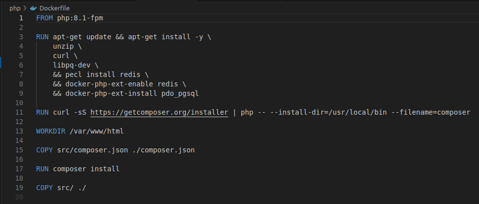

3. Далее создаем файл nginx.conf и заполняем его в папке nginx.

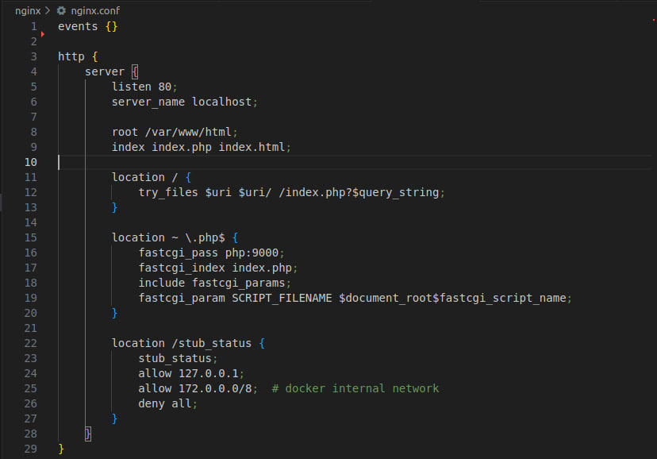

4. В папке src разархивируем наш index.php

5. Далее создаем docker-compose.yml и заполняем его согласно нашим сервисам. Прописываем базу данных, также все пароли и логины для подключения к бд и не забываем про порты.

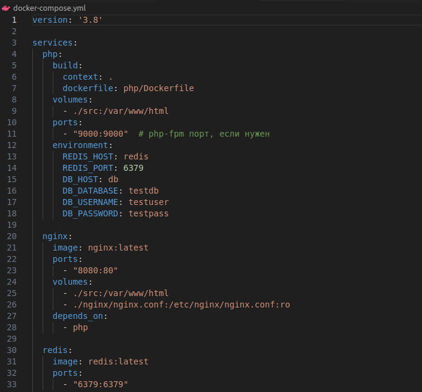

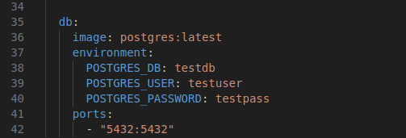

6. После этого запускаем наш docker-compose.yml командой "docker compose up -d"

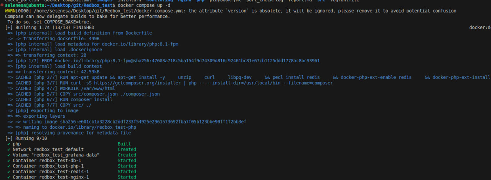

Результаты работы наших поднятых сервисов:

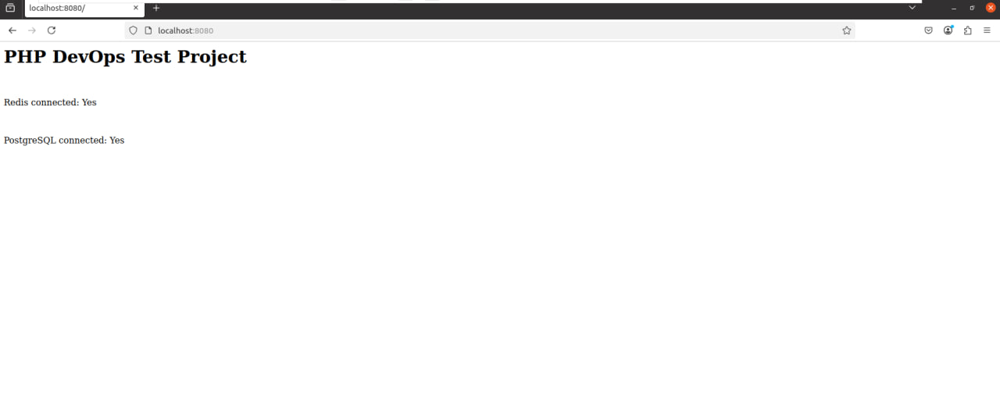

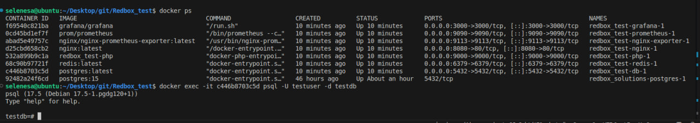


### 2. Настройка мониторинга (плюсом)

Добавьте Prometheus и Grafana для мониторинга контейнеров.

### Ожидается:

- `Docker Compose дополненный сервисами мониторинга`
- `Конфиг Prometheus (сбор метрик c Nginx)`
- `Один пример дашборда в Grafana (JSON или скриншот)`

# Решение:

1. Дополняем наш docker-compose.yml для prometheus и grafana.

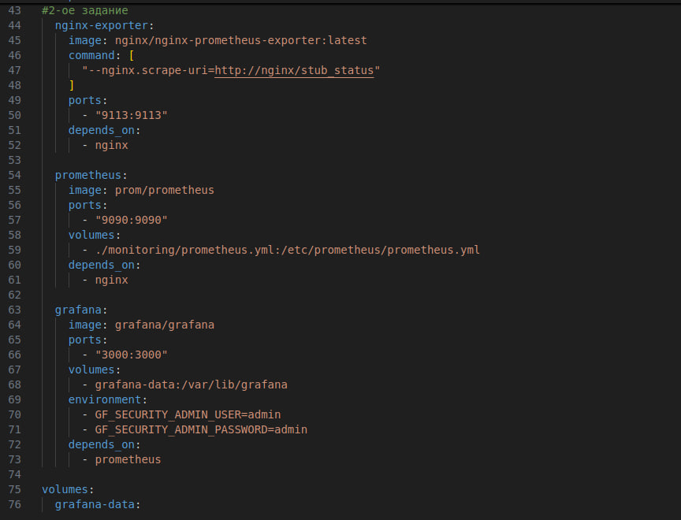

2. Запускаем наш docker-compose.yml и видим что все контейнеры поднялись в том числе prometheus и grafana.

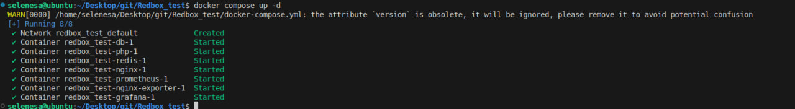

3. Далее можем подключиться по localhost и настроить наш prometheus и grafana, затем выбрать дашборд и увидеть что они оба соединены между собой и работают и результатом служат метрики которые выводятся на дашборде:

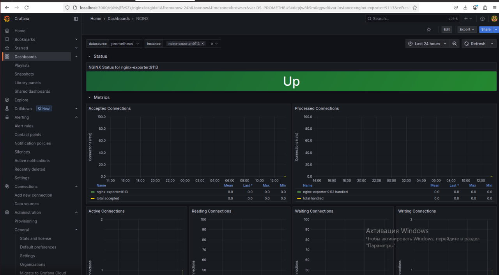

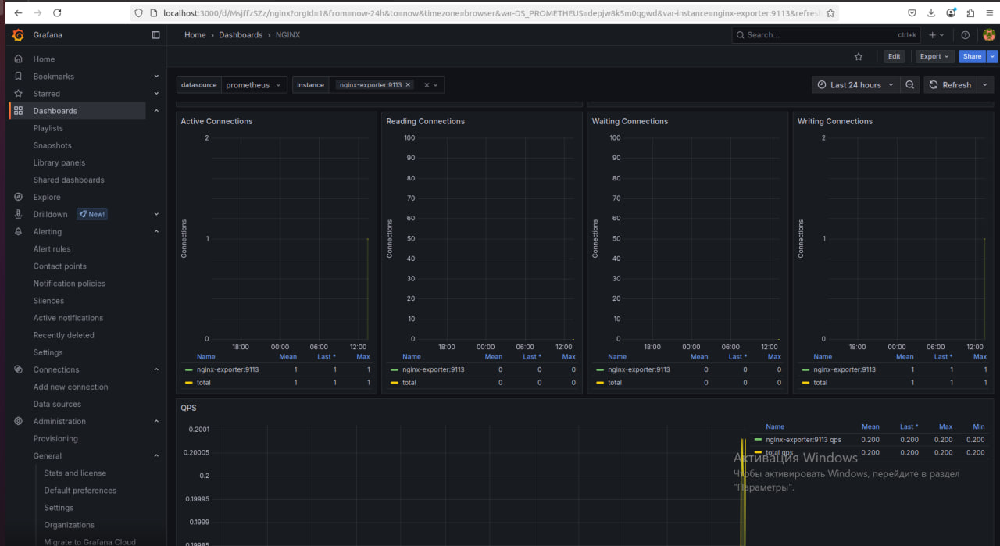

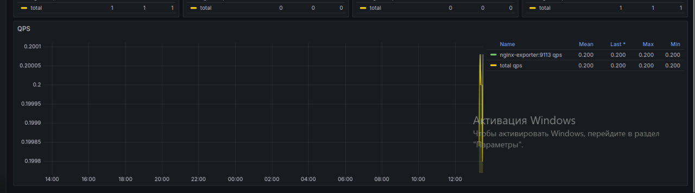

Результаты подключения локально:

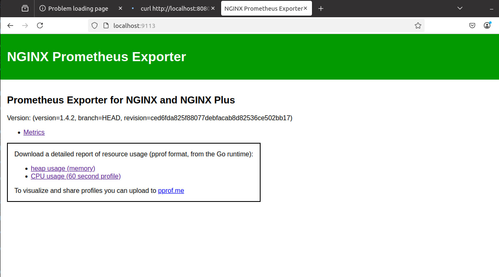

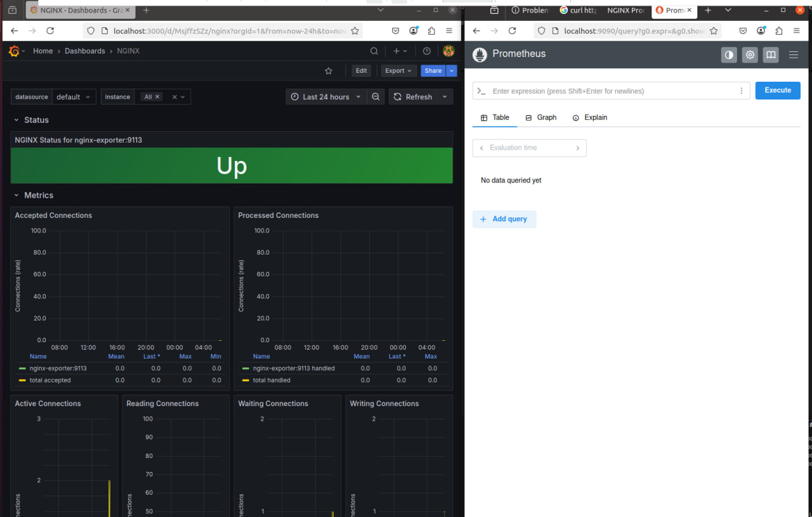


### 3. Разработка Ansible-плейбука

Напишите Ansible-плейбук, который:

- `Устанавливает docker`
- `Cкачивание проекта с git`
- `Запуск проекта через docker compose up -d`

### Ожидается:

- `Ansible-плейбук`

1. Для виртуализации я использовал vagrant, мне удобно поднимать виртуальные машины через него. Вот пример моего Vagrantfile:

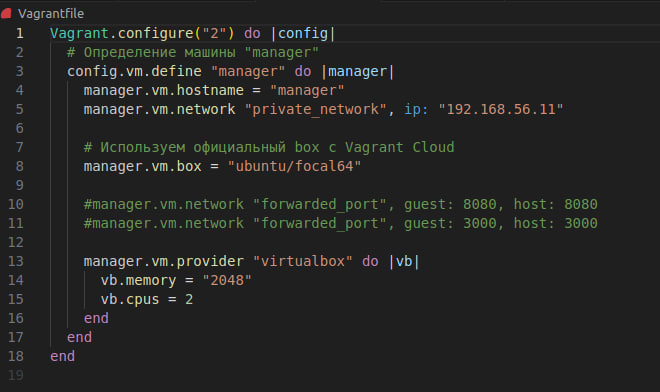

2. Далее покдлючаемся к нашей виртаульной машины с помощью команды vagrant ssh manager и заходим в нашу виртуальную машину.

3. После этого создаем файл inventory в котором прописан ip-адрес нашей виртаульной машины и путь к ssh ключу. Далее создаем наш playbook.yml:

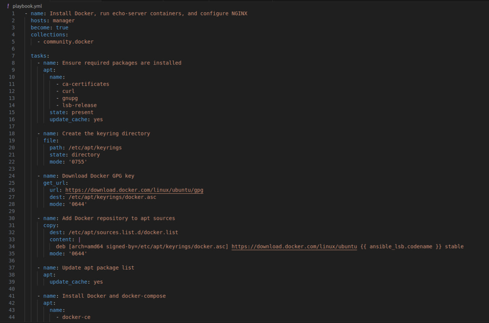

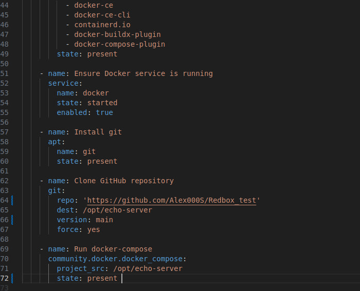

4. Далее запускаем наш playbook с помощью команды ansible-playbook -i inventory playbook.yml и видим успешный результат выполнения нашего playbook.yml:

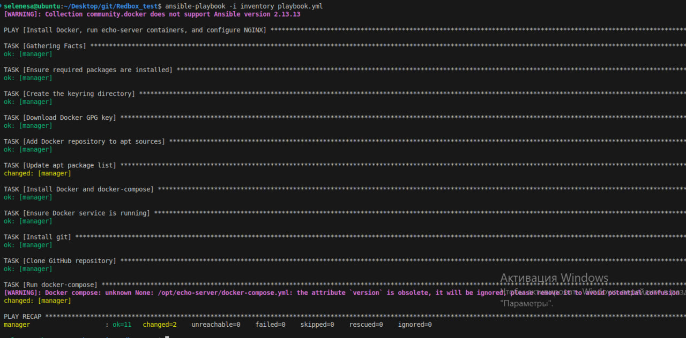

5. Далее заходим на нашу виртуальную машину с помощью команды vagrant ssh manager и проверяем появились ли наши контейнеры запущены ли они а также проверяем работоспособность с помощью команды curl:

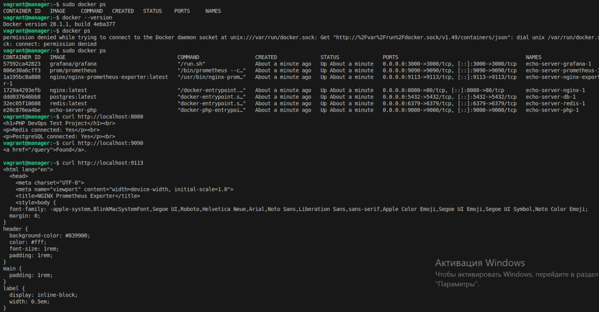


### 4. Мини-задача по bash

Напишите bash-скрипт, который:

- `Проверяет доступность порта на IP (например, host:port)`
- `В случае недоступности — пишет лог в файл`
- `[плюсом] Возможность указания host и port через аргументы запуска`

### Ожидается:

- `bash-скрипт`

1. Создаем файл и называем его check_port.sh

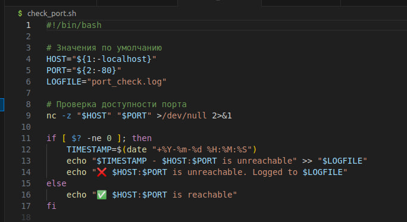

2. Результаты выполнения нашего скрипта:

Поднимаем наши контейнеры и ввыполняем наш скрипт

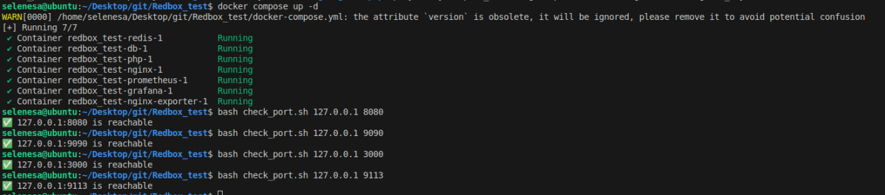

Далее выключаем контейнеры и проверяем работу нашего скрипта:

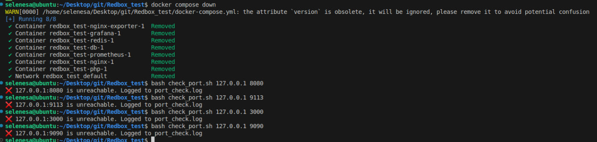

Также видим что у нас появился файл port_check.log в котором записаны контейнеры которые не поднялись.

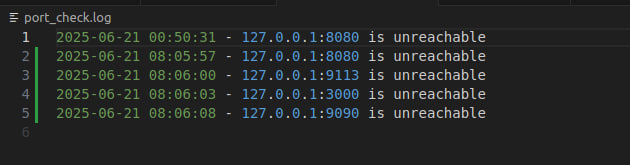